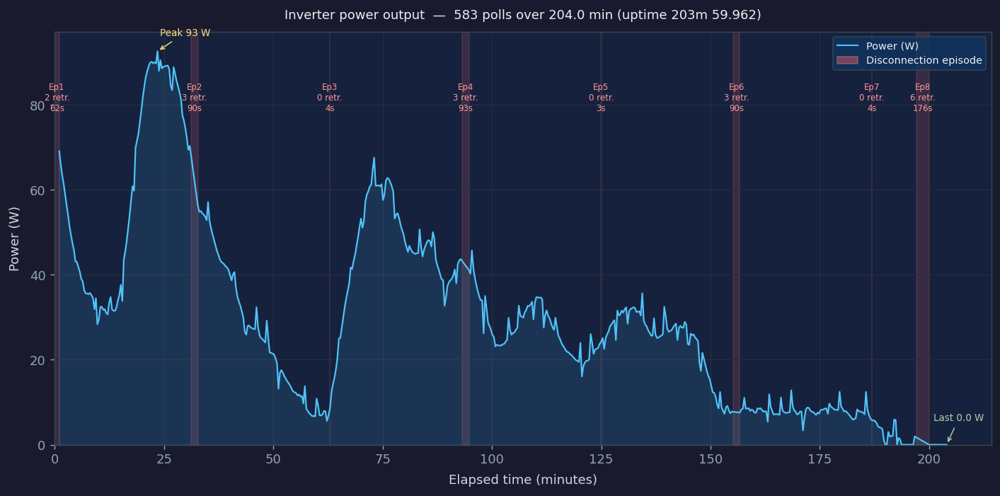

# ESP32 Inverter WiFi-to-Ethernet Bridge

The Mastervolt SOLADIN 1500 inverter has a built-in web interface, accessible over its own WiFi access point, that provides real-time production data and installer-level settings. This firmware bridges that interface to a wired home network.

Running on an **ESP32-S3** with an **ENC28J60** Ethernet module, it connects to the inverter's WiFi access point, reads the web interface every 20 seconds, and makes the data available through a REST API over Ethernet. A wake-pulse circuit keeps the inverter's WiFi radio alive between polls. The installer menu is also accessible via the API, so power output can be adjusted or stopped without needing direct WiFi access to the inverter.


*Live power output chart — generated from the onboard log buffer by the built-in analysis tooling.*

## Features

- **WiFi → Ethernet bridge** for inverters with a local WiFi AP only
- **REST API on port 8080** served over DHCP-assigned Ethernet IP
- **20-second live telemetry polling** with cached data for instant API responses
- **Installer menu access** — read and control inverter settings not normally exposed
- **Power output control** — limit or stop production in real time via `POST /api/power` (0–1575 W)
- **GPIO wake-pulse** to keep the inverter WiFi radio alive between polls
- **Circular log buffer** (1000 entries) with millisecond timestamps
- **Home Assistant compatible** — poll `/api/info` for power, yield, and status
- **A/B WiFi reconnect strategies** (dwell vs auto) with structured logging for passive performance analysis
- **Built-in analysis tooling** — CLI scripts to analyze logs, plot power output, and validate the API

## Hardware

- ESP32-S3 development board
- ENC28J60 Ethernet module (SPI)
- WiFi wake circuit on GPIO 36 (idle HIGH, active-LOW pulse)
- Connects to inverter access point: SSID `mastervolt-soladin-0103` / `10.0.0.1`
- Ethernet IP assigned by DHCP; API available at `http://<ip>:8080`

See [`docs/WIRING_README.md`](docs/WIRING_README.md) for the full pin table and electrical notes.

## API

REST API over Ethernet covering health, live telemetry, power control, shadow function, log access, and diagnostics. See [`docs/API_REFERENCE.md`](docs/API_REFERENCE.md) for the full endpoint reference.

## Build and Upload

```powershell
# Recommended (auto COM-port detection):
.venv\Scripts\python skills/firmware-upload/upload_firmware.py

# Or direct arduino-cli:
arduino-cli compile --fqbn esp32:esp32:esp32s3:CDCOnBoot=cdc firmware/esp32_inverter_bridge
arduino-cli upload  --fqbn esp32:esp32:esp32s3:CDCOnBoot=cdc --port COM9 firmware/esp32_inverter_bridge
```

See [`docs/SETUP_README.md`](docs/SETUP_README.md) for hardware assembly, library prerequisites, and IDE setup.

## Log Analysis

The bridge logs WiFi events, inverter polls, and API calls to a circular buffer. Built-in CLI tooling analyzes this data and generates power charts:

```powershell
# One-pass: session summary + connection analysis + power plot
.venv\Scripts\python skills/log-analysis/analyze_and_plot.py

# Analysis only
.venv\Scripts\python skills/log-analysis/analyze_bridge_logs.py

# Power chart only (saved to output/powerplot.png)
.venv\Scripts\python skills/log-analysis/plot_power.py
```

## Documentation

- [`docs/SETUP_README.md`](docs/SETUP_README.md) — Hardware assembly, wiring, prerequisites, flash instructions
- [`docs/WIRING_README.md`](docs/WIRING_README.md) — Pin table and electrical notes
- [`docs/ESP32_UPLOAD_README.md`](docs/ESP32_UPLOAD_README.md) — Upload procedure and post-flash verification
- [`docs/API_REFERENCE.md`](docs/API_REFERENCE.md) — Full endpoint reference
- [`docs/TEST_README.md`](docs/TEST_README.md) — Validation checklist and troubleshooting
- [`AGENTS.md`](AGENTS.md) — Architecture reference for agents and developers
- [`TECHNICAL_DEBT.md`](TECHNICAL_DEBT.md) — Known limitations and future enhancements

