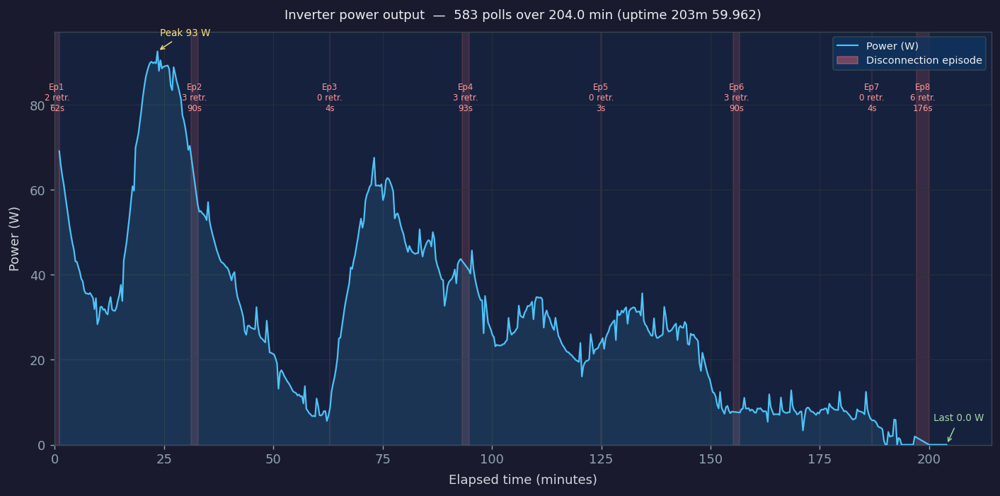

# ESP32 Inverter WiFi-to-Ethernet Bridge

This firmware bridges the Mastervolt SOLADIN inverter's WiFi interface to Ethernet on an ESP32-S3 with an ENC28J60 adapter. It polls the inverter over its local WiFi access point, exposes the live state through a REST API, and keeps the inverter radio reachable with a wake-pulse circuit.

## What It Does

- Exposes inverter health, telemetry, control, and logs over HTTP on port 8080
- Publishes MQTT discovery and state updates for Home Assistant
- Keeps the inverter WiFi radio available for long-term polling and strategy testing
- Stores logs locally for validation and connection analysis

## Documentation

- [`docs/SETUP_README.md`](docs/SETUP_README.md) — Hardware, prerequisites, and flashing setup
- [`docs/WIRING_README.md`](docs/WIRING_README.md) — Pin table and electrical notes
- [`docs/ESP32_UPLOAD_README.md`](docs/ESP32_UPLOAD_README.md) — Upload workflow
- [`docs/API_REFERENCE.md`](docs/API_REFERENCE.md) — REST endpoint reference
- [`docs/TEST_README.md`](docs/TEST_README.md) — Validation, troubleshooting, and log analysis
- [`docs/HOME_ASSISTANT.md`](docs/HOME_ASSISTANT.md) — MQTT and Home Assistant integration
- [`AGENTS.md`](AGENTS.md) — Repo-specific agent guidance

